# Feature 1 - edit, validate, store

# Iteration 01

[analyse]

First off lets start with a better understanding of the domain. The goal of this feature is to implement a HTTP-Resource for Products. This includes the following actions:

* show a product: (ID) -> (product{})
* edit product attributes: (product{}) -> (product{})
* assign structure to a product: (productID, structureID) -> (product{})
* list product IDs: () -> (ID*)

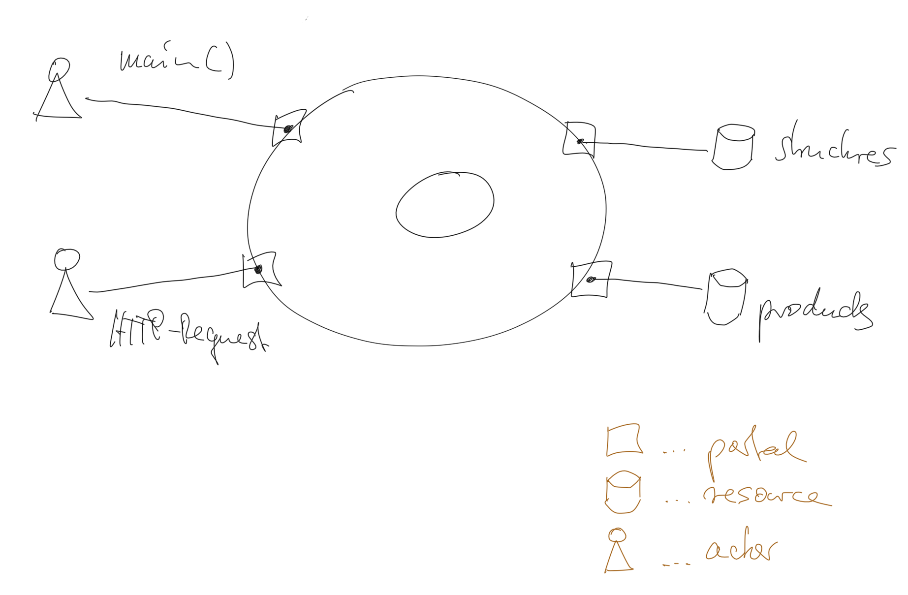

## Data-Model

**Product**
```
A: {
  ID: "",
  Name: "",
  StructureID: "",
  Attributes: [{
    ID: "",
    Name: "",
    Value: "",
    State: "{active|inactive}",
  }],
  Bs: [{
    ID: "",
    Name: "",
    Attributes: [{
      ID: "",
      Name: "",
      Value: "",
      State: "{active|inactive}",
    }],
    Cs: [{
      ID: "",
      Name: "",
      Attributes: [{
        ID: "",
        Name: "",
        Value: "",
        State: "{active|inactive}",
      }]
    }]
  }]
}
```

**Structure**
```
{
  ID: "",
  Name: "",
  Settings: [{
    ID: "",
    Name: "",
    Tier: {A|B|C},
    Datatype: {string|float32|int32},
  }]
}
```

## I. Iteration: List Product IDs

[analyse]

Display a list of product IDs when making "GET" request to "/products".

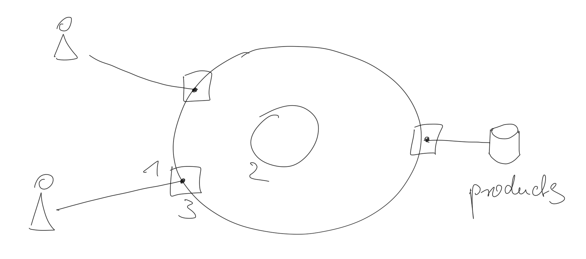

1) portal: receive HTTP request
1) kernel: `productIDs()`
3) portal: respond HTTP request

[design]

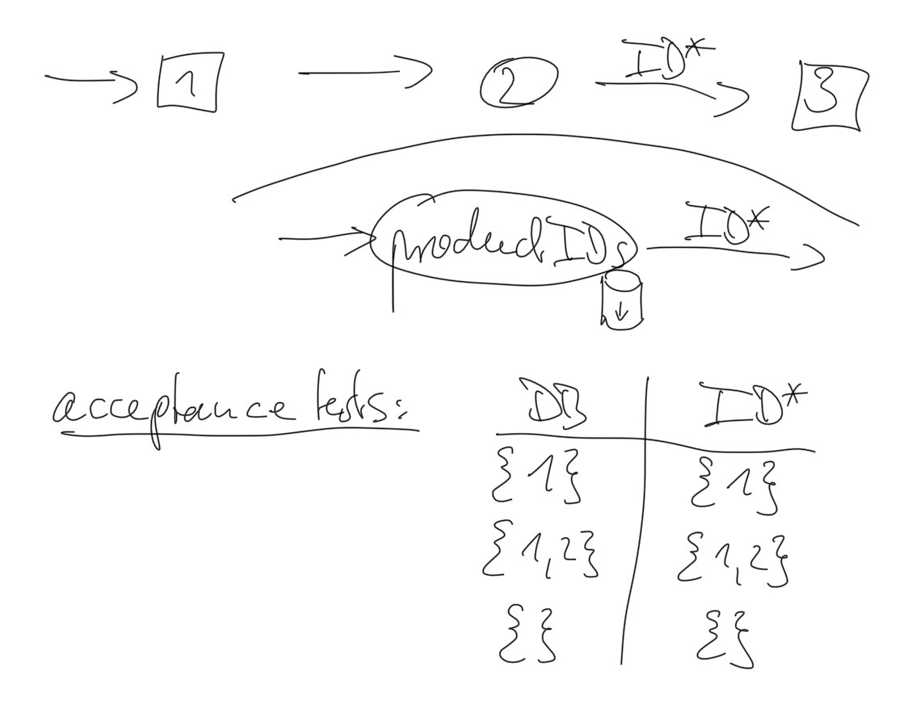


### first increment: implement HTTP-Workflow with fake IDs

[design]

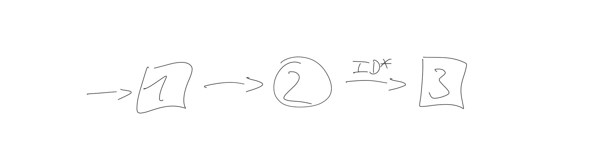

[implement]

[test_bed/product_ids.go](test_bed/product_ids.go)

```
go run test_bed/product_ids.go
```

visit [http://localhost:8080/products/](http://localhost:8080/products/)


### next increment: implement productIDs()

[design]

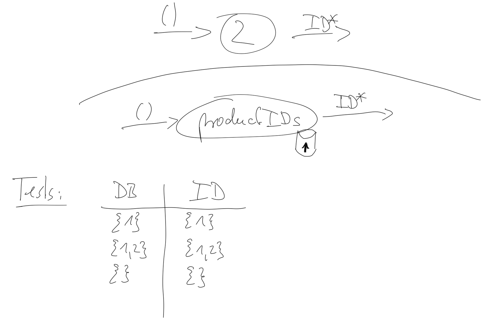

[implement]

* [product_provider.go](product_provider.go)
* [product_provider_test.go](product_provider_test.go)

```
go test -v
```


### next increment: integrate into one executable

[implement]

* [main.go](main.go)
* [main_test.go](main_test.go)
* [app.go](app.go)
* [features/list_product_ids.feature](features/list_product_ids.feature)
* [list_product_ids_test.go](list_product_ids_test.go)

execute acceptance tests (cucumber features)
```
godog
```

execute tests and features
```
go test -v
```

execute program
```
go build
./pim
```
visit [http://localhost:8080/products/](http://localhost:8080/products/)


### structure diagrams

**functions**
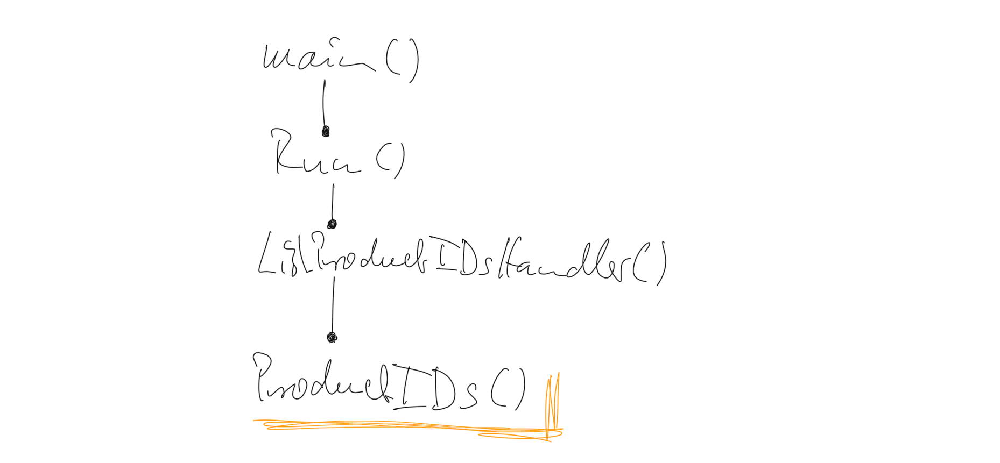

**classes**
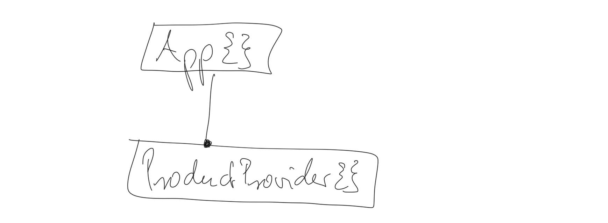

**files**
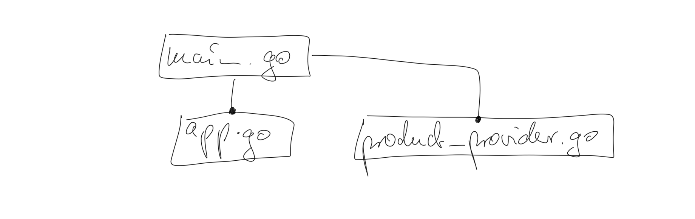


## II. Iteration: Show Product

[analyse]

Display an Product with Attributes when making "GET" request to "/products/:id"

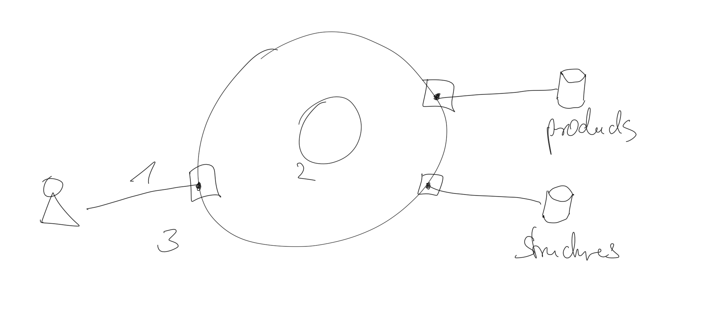

1) portal: receive HTTP request
1) kernel: `ShowProduct()`
3) portal: respond HTTP request

[design]

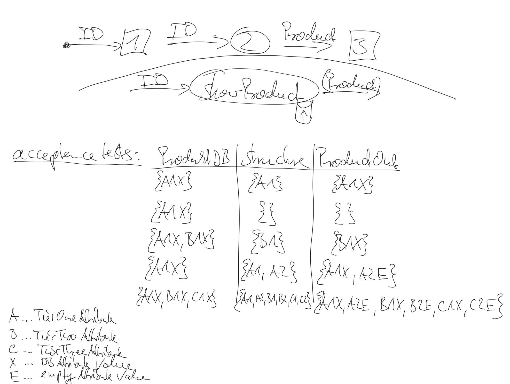


### first increment: implement HTTP-Workflow with fake Product{}

[design]

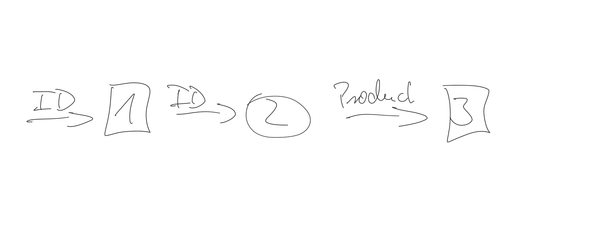

[implement]

[test_bed/show_product.go](test_bed/show_product.go)

```
go run test_bed/show_product.go
```

visit [http://localhost:8080/products/123](http://localhost:8080/products/123)


### next increment: implement AddRemoveAttributes()

[design]

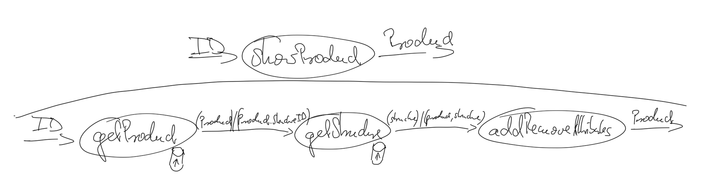

[implement]

* [add_remove_attributes.go](add_remove_attributes.go)
* [add_remove_attributes_test.go](add_remove_attributes_test.go)

```
go test -v
```

