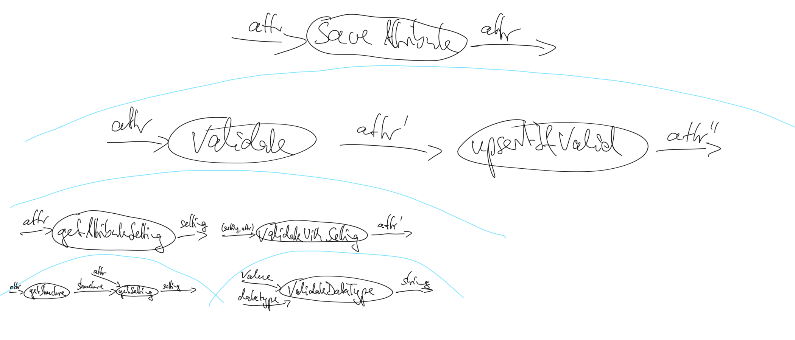

# Feature 1 - edit, validate, store

## a short overview of the development workflow

**1. analyse:** Build a better understanding of the domain. Understanding can only be verified using **tests**.

**2. design:** design a solution using **declarative** language (mathematics, decision tables, data flows, finite automata (regex, state machine)) 

**3. implement:** implement the solution using unit tests (**imperative**)

## building a better understanding of the domain

The basic idea of the first iteration is to validate product attributes with a structure. A structure describes each attribute of the product by datatype. For now that information is used to validate the attribute's value against the specified datatype.

[analyse]

**Product** 

A Product describes a multi-tier Element consisting of one A (tier-one), A consists of multiple B (tier-two) elements, B consists of multiple C (tier-three) elements).

```
A: {
  ID: "",
  Attributes: []Attribute,
  Bs: [{
    ID: "",
    Attributes: []Attribute,
    Cs: [{
      ID: "",
      Attributes: []Attribute,
    }]
  }]
}
```

**A (Tier-One)**
```
{
  ID: "",
  Attributes: []Attribute
	Bs: []B
}
```

**B (Tier-Two)**
```
{
  ID: "",
  Attributes: []Attribute
	Cs: []C
}
```

**C (Tier-Three)**
```
{
  ID: "",
  Attributes: []Attribute
}
```

**Attribute**
```
{
  ID: "",
  Name: "",
  Value: "",
  Type: "{fixed|validation}",
  ValidationText: "",
}
```

**Structure**

A structure describes valid attributes of the product. 
```
{
  ID: "",
  Name: "",
  AttributeSettings: [{
    ID: "",
    Name: "",
    Tier: {1|2|3},
    Datatype: {string|int32|float32},
  }]
}
```

## modellig a dataflow

[design]

This is a simple **data flow** to break down the feature into it's logical units (operation).




## first SMILE

[analyse]

SMILE ... **s**mallest **m**eaningful **i**ncrement for a **l**earning **e**ffect

-> define Tests for `ValidateDatatype()`:

datatype | value | **validation text**
---------|-------|--------------------
string   | "abc" | ""
string   | "1"   | ""
string   | "1.0" | ""
int32    | "abc" | "'abc' is not a valid datatype 'int32'"
int32    | "1"   | ""
int32    | "1.0" | "'1.0' is not a valid datatype 'int32'"
float32  | "abc" | "'abc' is not a valid datatype 'float32'"
float32  | "1"   | "'1' is not a valid datatype 'float32'"
float32  | "1.0" | ""

## write code

[implement]

* [validation.go](validation.go)
* [validation_test.go](validation_test.go)


